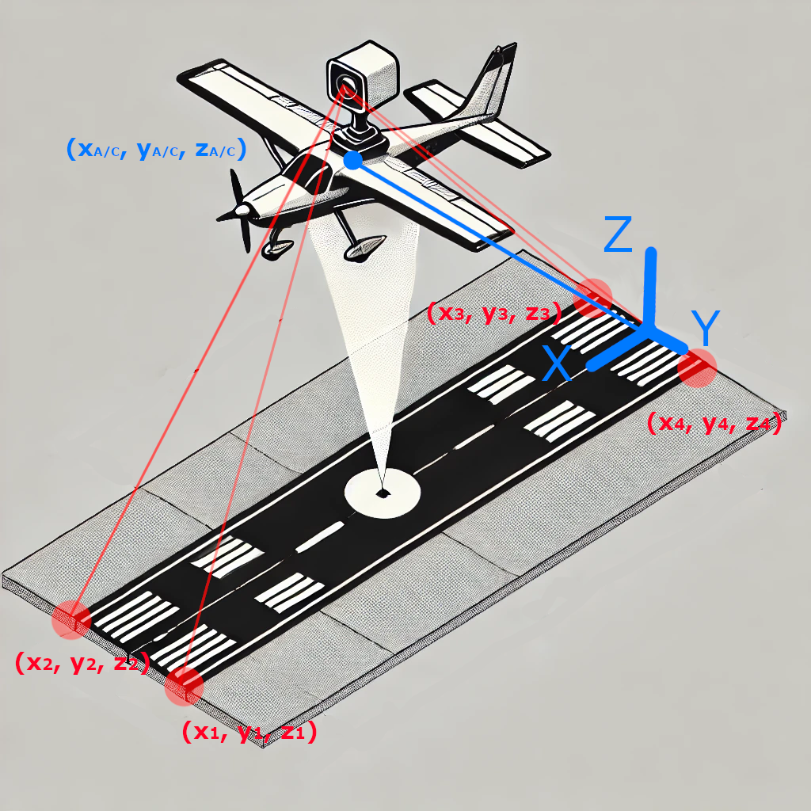
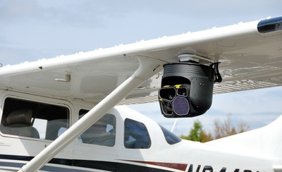

# Translation-PnP

## Table of contents

1. [Overview](README.md#1-overview)
2. [Quickstart](README.md#2-quickstart)
3. [Features](README.md#3-features)
4. [Install](README.md#4-install)
5. [Tests](README.md#5-tests)
---

## 1. Overview

Perspective-n-Point is the problem of estimating the pose of a calibrated camera given a set of *n* 3D points in the world and their corresponding 2D projections in an image. The camera pose has 6 degrees of freedom (DOF), which include the rotation (roll, pitch, and yaw) and the 3D translation of the camera with respect to the world reference frame (ref. [Wikipedia](https://en.wikipedia.org/wiki/Perspective-n-Point)).

This repository provides a closed-form solution for the camera’s position in the special case where the camera’s rotation is known (3 DOF). In the repo we refer to this special case as **Translation-PnP**.<br>
Only **n = 2** 2D–3D correspondences are required to solve this problem, whereas the full 6 DOF problem (unknown position and rotation) requires at least **n = 3** (P3P) or **n ≥ 4** in the more general case.

As of February 2025, this algorithm is not yet implemented in OpenCV.

An example application is included that uses this algorithm to determine the position of a camera onboard an aircraft relative to the runway.

|  |  |
|:--:|:--:|
| **Figure 1:** Aircraft PnP sketch. Original image by repo's author. | **Figure 2:** Camera mounted on aircraft. Image borrowed from [here](https://www.soloy.com/camera-mount.html). |

## 2. Quickstart

Run the following commands to build the `TPnP` project and its corresponding Python binding:

```bash
chmod +x build_all.sh
./build_all.sh
```

## 3. Features

In this repository you will find:

- **C++ source code for the** `TPnP` algorithm: located in the `src` and `include` folders.
- **Python binding of the C++** `TPnP` **function**: `src/binding.cpp`.
- **CMake instructions** for building a static `TPnP` library: `CMakeLists.txt`.
- **Example C++ project** using the `TPnP` library to calculate an aircraft's position relative to a runway using an onboard camera: `example/`.
- **Example of Python script** demonstrating how to use the C++ `TPnP` binding for Python: `example/main.py`.
- **Unit tests** for `TPnP` using [Catch2](https://github.com/catchorg/Catch2).
- **Dockerfile**  to create an Ubuntu-based image and build the `TPnP` project inside it: `Dockerfile`.

## 4. Install

### 4.1 Pre-requisites

- C++ compiler.
- CMake.
- Optional: Python >= 3 to use [pre-commit](https://pre-commit.com).

### 4.2 Setup

Run the following command to build the `TPnP` project and its corresponding Python binding:

```bash
./build_all.sh -t <build_type> # `build_type` can be "debug" or "release" and defaults to "release" if not specified
```

The above command also builds an example C++ project using the `TPnP` library and runs a Python script using the `TPnP` Python binding.

**Note**: You can run `chmod +x build_all.sh` to add execution permissions to the build script.

### 4.3 Set up pre-commit (Optional)

The following instructions allows to set up pre-commit for code development in this project:

```bash
conda create -n tpnp python=3.10 --no-default-pacakges -y
conda activate tpnp
pip install black clang-format pre-commit
pre-commit install
```

## 5. Tests

After building the `TPnP` project you can run the project tests using the following command:

```bash
ctest --test-dir build -R TPnPTests
```
